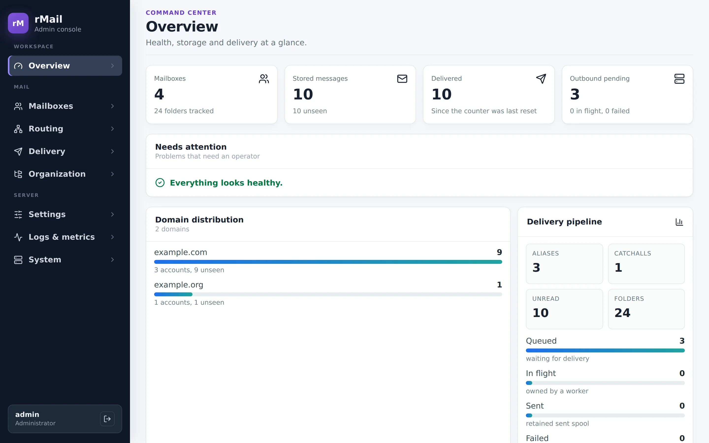
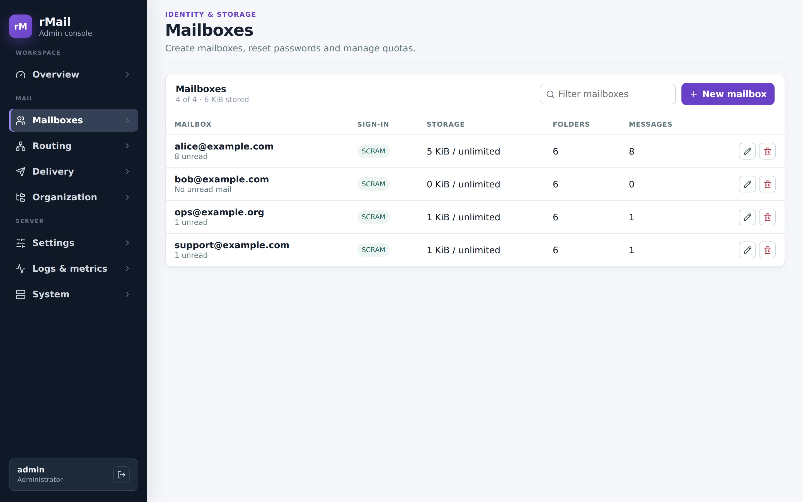
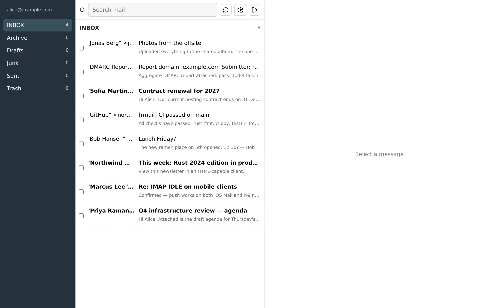
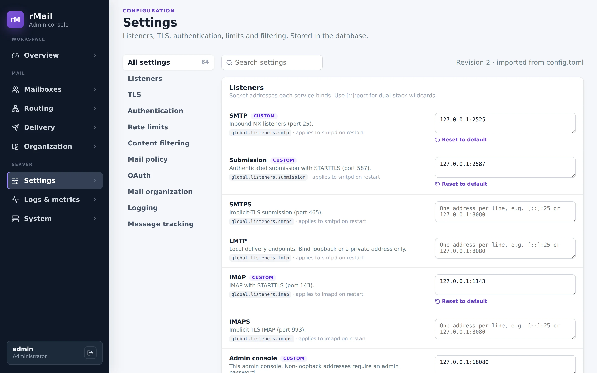
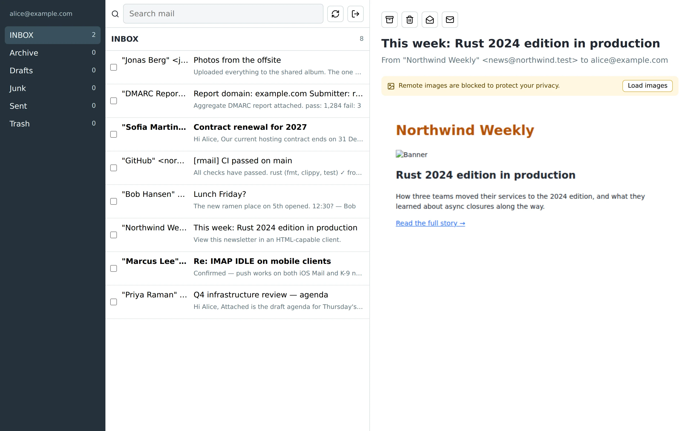

# Warning
This is mostly AI-generated by a mix of smaller and frontier models. It "works" here, but needs proper testing and auditing before real-world use.

# rMail

rMail - SMTP, authenticated submission, outbound relay, and IMAP servers in Rust, with a web admin
console and webmail.

**Project site: [mnj.github.io/rmail](https://mnj.github.io/rmail/)**. It has a feature overview,
screenshots of every page, and a quick start.



## Features

- **SMTP, submission and LMTP**: phase-aware ESMTP with STARTTLS, PIPELINING, 8BITMIME, SMTPUTF8,
  CHUNKING/BINARYMIME, DSN and REQUIRETLS; AUTH PLAIN, SCRAM-SHA-256 and optional OAUTHBEARER/XOAUTH2.
- **IMAP4rev1 and IMAP4rev2** over Maildir: IDLE, CONDSTORE/QRESYNC, MOVE, SORT/THREAD, PREVIEW,
  QUOTA, METADATA, NOTIFY, UIDONLY, REPLACE, COMPRESS and SCRAM-SHA-256-PLUS.
- **Mail authentication**: inbound SPF, DKIM, DMARC (with aggregate reports) and ARC; outbound DKIM
  and ARC signing; optional ClamAV and rspamd filtering.
- **Outbound relay queue** with retries, per-destination limits, connection reuse and
  experimental DANE.
- **Admin console** for mailboxes, quotas, aliases, catchalls, the outbound queue, database-stored
  settings, logs, Prometheus metrics and readiness checks.
- **Webmail** with folders, search, sandboxed HTML rendering, blocked remote images and a mobile
  layout.
- **Operations**: structured JSON logs, live `rmail_ctl watch`, per-message tracking, ACME
  certificates, and `.deb` packages for amd64 and arm64 published on every merge.

## Screenshots

| Admin console | Webmail |
| --- | --- |
|  |  |
|  |  |

More on the [screenshots page](https://mnj.github.io/rmail/screenshots.html). To regenerate them
after a UI change, run `scripts/screenshots/capture.sh`. It builds everything, starts a throwaway
demo instance on loopback ports, fills it with sample data and captures both apps with Playwright.

## Repository layout

- crates/common — shared protocol, storage, settings, HTTP and auth helpers
- crates/smtpd — SMTP/LMTP receiver and authenticated submission (Maildir delivery)
- crates/imapd — IMAP server exposing Maildir
- crates/outbound — outbound relay worker
- crates/queue-manager, crates/queuectl — outbound spool management
- crates/webui — admin console (`rmail_web`) and its React/Vite frontend
- crates/webmail — user-facing webmail server and React/Vite SPA
- crates/classifier — `rmail_classifier`, optional folder suggestions from local GGUF models (llama.cpp in-process)
- crates/ctl — `rmail_ctl` CLI for accounts, settings, certificates and services
- crates/bench — live performance workloads
- site — the GitHub Pages project site, deployed by `.github/workflows/pages.yml`
- scripts/screenshots — demo instance and Playwright capture for the site's screenshots

## Configuration

The configuration file only needs to bootstrap the storage locations:

```toml
[global]
mail_root = "/var/lib/rmail"
db_path = "/var/lib/rmail/rmail.db"
```

Everything else — listeners, TLS, SASL mechanisms, rate limits, content filtering, OAuth, tracking
retention — is stored in the SQLite database and edited on the admin console's **Settings** page or
with `rmail_ctl settings`. An existing full configuration file (see `config/example.toml`) is imported
into the database on first start. Services pick up changes on restart; the console shows which
services are waiting for one. Without `db_path`, the file is used as-is.

Set the admin console password with `rmail_ctl admin-password`, or open the console on its loopback
address and create the admin account in the browser.

Test TLS certificates for local runs go in config/certs/ (ignored by git); the test suite generates
its own.

Both frontends (webmail and admin console) use Bun:

```bash
cd crates/webmail/frontend   # or crates/webui/frontend
bun install
bun run typecheck
bun run build
```

Deployment and packaging guidance lives in [docs/DEPLOYMENT.md](docs/DEPLOYMENT.md).

## SMTP standards support

rMail implements an ESMTP receiver and authenticated submission path with
phase-aware `EHLO` extensions. SMTP commands are parsed through bounded
streaming input, transaction and authentication state are validated before
dispatch, and unsupported envelope extensions are rejected rather than
silently accepted. The percentages use the same server-applicable engineering
coverage methodology described in the IMAP section below; they are not formal
certification results.

| RFC | Feature | Estimated compliance | Remaining limitation |
| --- | --- | ---: | --- |
| RFC 5321 | SMTP transport and transactions | 95% | Strict command/reply framing, path grammar (256-octet path limit, extension-aware MAIL/RCPT line limits), Postmaster handling, DATA transparency with strict `<CRLF>.<CRLF>` termination (non-canonical terminators close the connection to prevent SMTP smuggling), nested-MAIL rejection, a configurable server hostname for greetings, EHLO and trace fields, sequencing, limits, and relay policy are implemented; multi-destination storage is not yet one cross-backend atomic commit and external conformance testing remains. |
| RFC 1869 | ESMTP framework | 95% | EHLO negotiation and extension parameters are implemented; no external conformance certification. |
| RFC 1870 | `SIZE` | 100% | The fixed maximum is advertised and declared or received oversized messages are rejected while preserving stream synchronization. |
| RFC 6152 | `8BITMIME` | 100% | BODY declarations are parsed and retained, undeclared 8-bit content is rejected after safe DATA draining, and outbound relay negotiates and declares 8BITMIME. |
| RFC 2920 | `PIPELINING` | 100% | Command pipelining is supported with ordered replies and guarded STARTTLS transitions. |
| RFC 3207 | `STARTTLS` | 95% | A real TLS upgrade, state reset, fresh EHLO requirement, timeout, and plaintext-pipelining rejection are integration-tested; external conformance testing remains. |
| RFC 4954 | SMTP AUTH | 95% | Configurable TLS-gated mechanisms, strict grammar, initial responses, bounded continuations, cancellation, state restrictions, the `AUTH=` MAIL parameter, and enhanced replies are implemented; external conformance testing remains. |
| RFC 4616 | SASL `PLAIN` | 100% | Initial and continuation forms, authzid policy, UTF-8 validation, and shared credential verification are implemented under TLS. |
| RFC 5802 / RFC 7677 | `SCRAM-SHA-256` and `SCRAM-SHA-256-PLUS` | 100% | Strict SCRAM grammar, stored verifiers, `y`-flag downgrade detection when -PLUS is offered, fake challenges for unknown users, client proof validation, and server-final data are implemented and integration-tested. -PLUS supports `tls-server-end-point` (RFC 5929) and `tls-exporter` on TLS 1.3 (RFC 9266). |
| RFC 6531 | `SMTPUTF8` | 100% | UTF-8 envelope/header use is declaration-gated, outbound relay negotiates and declares SMTPUTF8, and internationalized envelope domains are canonicalized to IDNA A-labels at persistence, routing, DNS, and authentication boundaries. RFC 6531 does not require downgrade support. |
| RFC 5890 / RFC 5891 | IDNA2008 domain handling | 95% | SMTP envelope domains, mailbox/alias/catchall identities, outbound DNS routes, and SPF/DKIM/DMARC alignment inputs share validated U-label-to-A-label canonicalization with DNS length checks; broad multilingual interoperability corpus testing remains. |
| RFC 3463 / RFC 2034 | Enhanced status codes | 100% | `ENHANCEDSTATUSCODES` is advertised and command, transaction, policy, delivery, TLS, and authentication replies carry class-appropriate enhanced codes. |
| RFC 3848 | Received trace protocol identifiers | 100% | Generated trace fields distinguish SMTP, ESMTP, TLS, and authenticated submission with the appropriate protocol token. |
| RFC 3461 | Delivery Status Notifications | 100% | `DSN`, `RET`, `ENVID`, `NOTIFY`, and `ORCPT` are implemented with private queue metadata and loop-safe success/failure reports. |
| RFC 8689 | `REQUIRETLS` | 100% | Advertised and accepted only on TLS sessions; submission, durable queue metadata, relay advertisement checks, and downgrade-resistant TLS enforcement are implemented. |
| RFC 3030 | `CHUNKING`/`BINARYMIME` | 95% | Both extensions are advertised together. The receiver supports exact-octet, multi-command BDAT transactions, LAST and zero-length chunks, cumulative SIZE enforcement with stream-preserving drains, DATA/BDAT state exclusion, and BODY=BINARYMIME validation. Relay capability negotiation selects binary-safe BDAT and requires both extensions for binary content; external conformance corpus testing remains. |
| RFC 7208 | SPF receiver checks | 85% | SPF evaluation and result accounting are implemented; broad DNS/interoperability corpus validation remains. |
| RFC 6376 | DKIM verification | 85% | DKIM verification and result accounting are implemented; exhaustive algorithm/canonicalization corpus validation remains. |
| RFC 7489 | DMARC policy | 90% | Alignment, policy outcomes, quarantine, optional rejection, and aggregate RUA report generation are implemented; forensic reporting is not implemented. |

SMTP AUTH mechanisms are configured independently with
`security.smtp_sasl_mechanisms`. `OAUTHBEARER` and `XOAUTH2` can be enabled when
an OAuth token-introspection authority is configured under `security.oauth`.

## IMAP standards support

rMail advertises `IMAP4rev1` and `IMAP4rev2` and implements the core mailbox, message, search,
state-transition, literal, and response behavior required by RFC 3501. Its IMAP
implementation also includes the extensions listed below. Capabilities are
phase-aware: authentication mechanisms, `STARTTLS`, and post-authentication
extensions are advertised only when they are usable in the current session.

The percentages are engineering coverage estimates, not certification results.
They measure implemented and automated-tested server-side requirements that are
applicable to rMail; client-only requirements and optional behavior outside the
advertised capability are excluded. A value below 100% identifies known scope
or conformance-validation gaps.

| RFC | Feature | Estimated compliance | Remaining limitation |
| --- | --- | ---: | --- |
| RFC 3501 | IMAP4rev1 core | 95% | Includes sequence-number stability: EXPUNGE is never sent during FETCH, STORE or SEARCH, and messages expunged by other sessions keep their slot (`EXPUNGEISSUED`) until the next allowed point; an inactivity autologout (3 minutes before login, 30 minutes after, including IDLE) is enforced. No formal protocol test-suite certification or exhaustive live-client matrix yet. |
| RFC 9051 | IMAP4rev2 core | 90% | Dual-advertised; after `ENABLE IMAP4rev2` the session uses UTF-8, omits `RECENT`/`\Recent`, answers SEARCH with ESEARCH, and includes the mailbox LIST line in SELECT. `STATUS DELETED` is supported, and RENAME returns LIST responses with `OLDNAME` for the renamed mailbox and its children. No external rev2 conformance certification yet. |
| RFC 2595 | IMAP `STARTTLS` and `LOGINDISABLED` | 95% | A real TLS upgrade and resumed IMAP session are integration-tested, but not yet against an external conformance harness. |
| RFC 2177 | `IDLE` | 100% | Implemented with mailbox synchronization, keepalives, fragmented `DONE`, and bounded input. |
| RFC 2342 | `NAMESPACE` | 100% | Complete for rMail's single personal Maildir namespace. |
| RFC 2971 | `ID` | 100% | Includes strict argument and size validation. |
| RFC 4315 | `UIDPLUS` | 100% | `APPENDUID`, `COPYUID`, and `UID EXPUNGE` are implemented. |
| RFC 3502 | `MULTIAPPEND` | 100% | Streamed literal and CATENATE messages publish atomically with ordered `APPENDUID` sets and rollback on any failure. |
| RFC 5161 | `ENABLE` | 100% | Enabled features are tracked per session and validated. |
| RFC 5256 | `SORT` and `THREAD` | 90% | Advertised algorithms are implemented; international collation coverage is not exhaustive. |
| RFC 4731 | `ESEARCH` | 95% | Core and UID result forms are implemented; no external conformance certification. |
| RFC 5182 | `SEARCHRES` | 100% | Saved search results and `$` sequence-set use are implemented. |
| RFC 9394 | `PARTIAL` | 100% | `SEARCH`/`UID SEARCH RETURN (PARTIAL first:last)` pages ESEARCH results, counting from the end for negative ranges and answering `NIL` for a page past the results; it combines with `MIN`/`MAX`/`COUNT` and saves `$` as RFC 9394 Table 1 specifies. The `UID FETCH` `PARTIAL` modifier picks the page before `CHANGEDSINCE` filters it. |
| RFC 5032 | `WITHIN` | 100% | `OLDER` and `YOUNGER` search keys are implemented. |
| RFC 5258 | `LIST-EXTENDED` | 95% | Selection/return options and hierarchy attributes are implemented; exotic namespace combinations are not applicable. |
| RFC 5819 | `LIST-STATUS` | 100% | STATUS return data is supported in extended LIST responses. |
| RFC 6154 | `SPECIAL-USE` and `CREATE-SPECIAL-USE` | 100% | Discovery, requested special-use mailbox attributes, and CREATE with `USE` are implemented. |
| RFC 7162 | `CONDSTORE` and `QRESYNC` | 90% | Mod-sequences, `CHANGEDSINCE`, `UNCHANGEDSINCE`, `VANISHED`, QRESYNC SELECT, implicit CONDSTORE enabling, and UID/MODSEQ in every untagged FETCH are implemented; no multi-server replication validation. |
| RFC 6851 | `MOVE` | 100% | Sequence and UID forms include UIDPLUS response data. |
| RFC 6855 | `UTF8=ACCEPT` | 85% | UTF-8 mailbox/message operation is implemented; `UTF8=ONLY` is not advertised or implemented. |
| RFC 3516 | `BINARY` | 95% | Binary FETCH sections and sizes are implemented; exhaustive MIME corpus validation remains. |
| RFC 4466 | Collected extension grammar | 95% | Extension argument/response forms used by advertised capabilities are implemented. |
| RFC 4469 | `CATENATE` | 100% | Streaming `TEXT`, relative same-session message/section `URL`, URL literals, `BADURL`, `TOOBIG`, and `APPENDUID` are implemented. |
| RFC 8970 | `PREVIEW` | 100% | MIME-aware UTF-8 previews and the `LAZY` priority modifier are implemented with bounded output. |
| RFC 2087 | `QUOTA` | 95% | Account-wide STORAGE limits, GETQUOTA/GETQUOTAROOT, atomic APPEND/COPY and SMTP enforcement, and `OVERQUOTA` are implemented; regular users cannot change limits through SETQUOTA. |
| RFC 2088 / RFC 7888 | `LITERAL+` / `LITERAL-` | 100% | Synchronizing and bounded non-synchronizing literals are implemented. |
| RFC 4978 | `COMPRESS=DEFLATE` | 100% | Compression negotiation and post-negotiation command transport are implemented. |
| RFC 4959 | SASL initial response | 100% | Initial, empty, continuation, and cancellation responses are supported. |
| RFC 4616 | SASL `PLAIN` | 100% | Available only under the configured encrypted-transport policy. |
| RFC 5802 / RFC 7677 | `SCRAM-SHA-256` | 100% | Includes stored SCRAM credentials, verifier checks, `y`-flag downgrade detection, and fake challenges for unknown users. |
| RFC 5929 / RFC 9266 | `SCRAM-SHA-256-PLUS` channel binding | 100% | Supports `tls-server-end-point`, and `tls-exporter` on TLS 1.3. |
| RFC 4013 | SASLprep | 100% | Usernames and SCRAM passwords are prepared with full SASLprep (mapping, NFKC, prohibited characters, bidi checks). |
| RFC 7889 | `APPENDLIMIT` | 100% | The server-wide APPEND size limit is advertised. |
| RFC 8474 | `OBJECTID` | 90% | Permanent `MAILBOXID` (kept across RENAME) and `EMAILID` (kept across COPY and MOVE) come from random IDs stored in the index, never reused. They are reported by CREATE, SELECT/EXAMINE, STATUS, LIST-STATUS and FETCH, and `SEARCH EMAILID` works. `THREADID` is always `NIL`, as the RFC allows when a server has no permanent thread IDs. |
| RFC 5464 | `METADATA` | 90% | `GETMETADATA` (with `MAXSIZE`/`LONGENTRIES` and `DEPTH`) and atomic `SETMETADATA` for server (`""`) and mailbox entries under `/private` and `/shared`. Entries are stored in the account index, follow a mailbox across RENAME and are removed with it. Limits: 64 KiB per value (`MAXSIZE`) and 512 entries per account (`TOOMANY`); `/shared/admin` is read-only. Values must be UTF-8 text (no `literal8`); unsolicited METADATA change notifications are sent only through `NOTIFY`. |
| RFC 5465 | `NOTIFY` | 85% | `NOTIFY SET [STATUS]` and `NOTIFY NONE` with the `SELECTED`, `SELECTED-DELAYED`, `INBOXES`, `PERSONAL`, `SUBSCRIBED`, `SUBTREE` and `MAILBOXES` filters. Events: `MessageNew` (with fetch attributes for the selected mailbox), `MessageExpunge`, `FlagChange`, `MailboxName`, `SubscriptionChange`, `MailboxMetadataChange` and `ServerMetadataChange`; `AnnotationChange` is refused with `BADEVENT`. Changes are found by polling storage between commands and during IDLE (every second for the selected mailbox, every two seconds for the others), so they arrive with that delay; the session's own changes are reported too. More than 1000 changes in one scan end notifications with `NOTIFICATIONOVERFLOW`. |
| RFC 9586 | `UIDONLY` | 100% | After `ENABLE UIDONLY`, FETCH, STORE, SEARCH, SORT, THREAD, COPY and MOVE, a sequence-set search key in the UID forms, and the QRESYNC message sequence match data are refused with `BAD [UIDREQUIRED]`. Message data goes out as `UIDFETCH` and expunges as `VANISHED` in command responses, unsolicited updates, IDLE and NOTIFY; SELECT leaves out the sequence-numbered `UNSEEN` code. |
| RFC 5267 | `ESORT`, `CONTEXT=SEARCH` and `CONTEXT=SORT` | 90% | `SORT`/`UID SORT RETURN (...)` answers with ESEARCH in sort order (`MIN`/`MAX` are the first and last sorted results; `SAVE` works as for SEARCH). `CONTEXT` (a hint) and `UPDATE` are accepted by SEARCH and SORT, and SORT also takes RFC 9394 `PARTIAL` (paging by sort position); `CANCELUPDATE` ends updates. Updating contexts send `ADDTO`/`REMOVEFROM` (with context positions for SORT, position 0 for SEARCH) whenever the session's view changes: its own STORE/EXPUNGE/MOVE, synchronization before commands, IDLE and NOTIFY. `REMOVEFROM` precedes the causing `EXPUNGE` and `ADDTO` follows `EXISTS`. Message numbers and `$` in the search program are resolved when the command runs. Up to 16 contexts per session (then `NO [NOUPDATE]`); they end when the mailbox is deselected. Time-relative keys (`YOUNGER`, `OLDER`) are re-evaluated only when a message changes, and other sessions' changes are seen only when the session synchronizes (between commands, during IDLE, or on NOTIFY polls). |
| RFC 8437 | `UNAUTHENTICATE` | 100% | Returns the session to the not-authenticated state while keeping TLS and compression. |
| RFC 8508 | `REPLACE` | 95% | `REPLACE` and `UID REPLACE` store the new message and expunge the old one in one index transaction, so a failed append leaves the old message in place. The message takes the same forms as APPEND (flags, date-time, synchronizing and non-synchronizing literals, `literal8`/UTF8, `CATENATE`, `APPENDLIMIT`/`TOOBIG`). Replies follow MOVE: `OK [APPENDUID]`, `EXISTS` when the target is the selected mailbox, then `EXPUNGE` or `VANISHED` (QRESYNC). A missing target gets `TRYCREATE`, a read-only mailbox `READ-ONLY`. The UTF8 data item uses the same framing as APPEND (closing parenthesis on the command line). |

IMAP4rev2 is dual-advertised with IMAP4rev1 for compatibility; clients enable
rev2 UTF-8 behavior with `ENABLE IMAP4rev2`. OAuth mechanisms can be enabled
with a configured token-introspection authority. The
deprecated draft `SNIPPET=FUZZY` dialect is available as a compatibility alias
for RFC 8970 previews. RFC 3502 `MULTIAPPEND` provides atomic streamed batch appends and
ordered `APPENDUID` sets. RFC 8970 `PREVIEW`, including its `LAZY` priority
modifier, is supported.

Repeatable storage and queue performance workloads are documented in
[docs/PERFORMANCE.md](docs/PERFORMANCE.md); `rmail_bench` provides live IMAP, SMTP, BDAT, IDLE,
and outbound queue-drain workloads.
